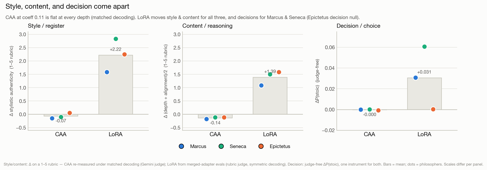

# Stoic Steering

Steering Stoic philosophical reasoning into Llama-3.2-3B via activation
addition (CAA) and low-rank weight adaptation (LoRA), with mechanistic
interpretability to check what actually changes inside the model.

**Core finding:** under fair measurement at the canonical coefficient (0.11),
CAA moves nothing (not style, not judge-scored content, not decisions). LoRA
does move the judge-free decision instrument, plus judge-scored style and
content (single eval, not seed-tested). The earlier positive CAA effects were a
measurement artifact — see
[docs/measurement-artifact.md](docs/measurement-artifact.md).



---

## Key findings

- **CAA at the canonical coefficient (0.11) does nothing measurable.**
  Decisions are flat on the logit-measured test, since it is
  one forward pass with no generation (no decision-level sweep across
  coefficients has been done). Style and content *appeared* to move, but under
  matched decoding both collapse to zero (style: +1.0…+1.6 reported →
  −0.15…+0.05 greedy). Whether stronger coefficients produce genuine Stoic
  register under fair measurement is an open question, not a claimed result.

- **The CAA "content effect" is a measurement artifact.** An earlier
  measurement reported a large positive effect, this was because steered text
  was sampled and truncated to ~13 tokens while baselines were greedy at 100,
  this meant the judge scored the decoding difference, not the steering. Under
  identical decoding on both sides, the content effect is null for all three
  philosophers (e.g. Epictetus L8: +0.767 ± 0.076 → −0.12 ± 0.08 matched-greedy
  / −0.19 ± 0.33 matched-sampled). Full mechanism and numbers can be found in
  [docs/measurement-artifact.md](docs/measurement-artifact.md).

- **LoRA reaches the decision layer.** On the forced-choice instrument (where
  CAA is flat), weight-level adaptation moved the choice — measured judge-free
  from the frozen adapters (matches this repo's regression fixtures to 4
  decimals):

  | Author | ΔP(stoic) | Δlog-odds | t | Stance buckets |
  |---|---|---|---|---|
  | Seneca | +0.061 | +0.308 | 2.4–2.6 | positive in *both* |
  | Marcus | +0.031 | +0.161 | 2.0–2.2 | accepting only |

  A circuit-topology analysis with ModelLens (run on the same clean adapters)
  shows the same method split:
  - CAA leaves the stoic-content circuit essentially untouched
  - LoRA's circuit perturbation is ordered Seneca > Marcus > Epictetus ≈ 0 (same ordering as the decision shift).
  **Caveat:** the two methods also train on different objectives (CAA is
  contrastive, LoRA is continued pretraining), so method and objective are
  confounded, the non-philosophical control adapter (v3) is what
  separates them.


- **What LoRA installs is not (yet) uniform Stoic reasoning.** Effects are
  structured but heterogeneous. Marcus is a broad *passivity prior* (it moves
  only the "accepting" dilemmas and is flat on "active" ones). Seneca moves the
  choice on average (t = 2.4–2.6 overall), but that average is carried by a
  handful of items shifting a lot, not a steady push across all 40 (the
  per-item sign test, which only asks whether *most* items moved toward the
  Stoic option, is not significant (25 of 40 positive, p = 0.15)). The effect
  is real in size but not uniform across dilemmas. Epictetus is a *null* (ΔP
  +0.000); candidate explanations — the smallest training corpus (123 chunks,
  the Enchiridion only) and its terse, aphoristic style, unlike Seneca's
  discursive letters or Marcus's reflections — are confounded with each other
  and with the philosopher, so the cause stays an open question. A possible
  Senecan-idiom lexical-echo confound in the decision instrument is also under
  investigation. These are stated openly as open questions, not smoothed over.

The circuit-level picture agrees with the behavior (Exp 12, clean adapters):
CAA at coeff 0.11 leaves the stoic-content circuit essentially untouched, while
LoRA is the largest circuit modifier — robust at the median, with an
item-dependent effect on content discrimination rather than a directional push.
Full analysis in [results/README.md](results/README.md).


---

## Method

Three depths of effect are measured separately:

- **Style / register** -- LLM-judge scoring of prose (does it sound Stoic?)
- **Content / reasoning** -- LLM-judge scoring of reasoning in prose
- **Decision / choice** -- judge-free forced-choice probe over calibrated
  dilemmas (does the model *pick* the Stoic option?)

Two interventions are compared: **CAA** (runtime activation steering,
reversible) and **LoRA** (fine-tuned adapter weights, permanent). Both are
analyzed with **ModelLens**, an architecture-agnostic interpretability
toolkit (companion project), to compare the circuit topology each method
uses to produce the same behavioral outcome.

Philosophers studied: Marcus Aurelius, Seneca, Epictetus -- three Stoic
traditions, done rigorously rather than many traditions done shallowly.

---

## Repo structure

```
stoic/
  config.py     # paths + canonical config (per-author layer/coeff, decoding)
  model.py      # model loading + the ONE generate() (decoding lives here only)
  steering.py   # CAA: extract_vector(pairs, layer) + steering() context manager
  dilemmas.py   # judge-free forced-choice harness (the 0.542 ruler) + stats
  judge.py      # LLM-as-judge scoring (Gemini) + seed evals
  lora.py       # LoRA merge (fresh base per adapter) + prep/train for Colab
  corpus.py     # Pass B: Gutenberg download, license-strip, slice, chunk
  pairs.py      # Pass B: contrastive pair generation (Claude API)
  results_io.py # checkpoint JSON writing (always under results/<stage>/)
  secrets.py    # API-key lookup (env, then .env) — stages fail fast if missing
  stages/       # stage orchestration: verify.py (0-2), content.py (3+style),
                #   adapters.py (4), passb.py (corpus/pairs)
  __main__.py   # thin CLI: python -m stoic <stage> (parse + dispatch only)
tests/          # CPU-only unit tests (no model download): hook hygiene,
                #   canonical decoding, dilemma math, stats vs published
                #   numbers, reference-wall tripwire, fixture integrity
data/
  reference/    # FROZEN artifacts (pairs, dilemma sets, vectors) — read-only
  generated/    # pipeline output (gitignored)
  MANIFEST.sha256  # checksums of the untracked frozen binaries
models/         # frozen clean LoRA adapters (not in git)
results/        # one JSON per stage checkpoint + results/README.md record
```

## Quickstart

```bash
# install (core = stages 0-2; extras: [judge] for stage 3, [lora] for stage 4)
pip install -e ".[all]"

# fetch the frozen binaries (steering vectors + LoRA adapters) — needed for
# Stages 2 and 4 only; downloads ~26 MB and verifies against data/MANIFEST.sha256
python scripts/fetch_artifacts.py

# Pass A checkpoints
python -m stoic all       # stages 0-2: determinism, 0.542 baseline, vectors + CAA null
python -m stoic stage3    # judge-scored content effect (needs GEMINI_API_KEY, ~$1-2)
python -m stoic stage3 --sampled   # matched-sampled variant
python -m stoic style     # style/register validation under matched decoding
python -m stoic stage4    # LoRA decision shift (judge-free, $0)

# Pass B — regenerate the corpus from source (self-contained)
python -m stoic corpus    # download + slice + chunk into data/generated/, verify counts
python -m stoic pairs     # regenerate contrastive pairs (needs ANTHROPIC_API_KEY, $)

# Unit tests (CPU-only, seconds, no model download)
pip install -e ".[dev]" && pytest
```

Setup notes: `meta-llama/Llama-3.2-3B` is gated on Hugging Face (accept the
license, then `huggingface-cli login`). The frozen steering vectors and LoRA
adapters are hosted separately (too large for git) at
[`seb-vil/llama-3.2-3b-stoic-steering`](https://huggingface.co/seb-vil/llama-3.2-3b-stoic-steering);
`scripts/fetch_artifacts.py` downloads them into place and verifies against
`data/MANIFEST.sha256`. Stage 3 / style need `GEMINI_API_KEY` and Pass-B pairs
need `ANTHROPIC_API_KEY` (env or a project-root `.env`); `corpus` needs
neither. Everything runs on local CPU (~16 GB RAM); a Colab T4 is only needed
to *retrain* adapters.

---

## Status

**Verified (against this repo's frozen regression fixtures):**
- Everything logit-measured is exact: dilemma baseline 0.541602, CAA decision
  null (ΔP to 4 decimals), LoRA decision shifts (all authors, all stance
  buckets, to 4 decimals).
- The judge-scored CAA effects are a single decoding-asymmetry artifact:
  content (+0.41…+0.77 → null) and style (+1.0…+1.6 → null) both collapse under
  matched decoding. Mechanism + numbers:
  [docs/measurement-artifact.md](docs/measurement-artifact.md); full record in
  [results/README.md](results/README.md).
- Corpus acquisition is self-contained: `python -m stoic corpus` re-downloads
  and re-chunks the source texts, reproducing the frozen chunk counts exactly
  (437 / 540 / 123; the stage compares counts, not byte-level chunk content).

**In progress / next (priority order):**
1. `dilemmas_v3` — the reasoning-vs-echo gate: 2×2 design (Letters-core vs
   off-topic × plain vs Stoic-idiom phrasing), stance-balanced, calibrated to
   per-cell P(stoic) ≈ 0.5 before any eval. Tests whether the LoRA decision
   shift is reasoning or Senecan lexical echo.
2. Behavioral LoRA eval on v3 — all three adapters plus a matched-length
   non-philosophical control adapter (attributes the shift to the philosophy,
   not to "any adapter").
3. Circuit sweep on v3 — retires the n=1-per-stance pilot caveat on Exp 12c
   (gated on ModelLens core regression tests).
4. Stability sweep (temperature × seed on the judge-free decision instrument)
   — gated on the v3 verdict: canceled if v3 returns pure lexical echo.
5. Pass B: regenerate contrastive pairs from the in-repo corpus pipeline and
   re-run stages 2–4 on fresh data (pipeline-robustness test).
6. Remaining figures (pair-quality flip; CAA coefficient sweep flat to 1.5)
   from existing JSONs, then the write-up.

Descoped: Epictetus full-corpus retrain — the adapter is a decision-level
null, so the corpus-size hypothesis stays a named open question rather than a
work item.

---

## Notes

Companion project: **ModelLens**, the architecture-agnostic interpretability
toolkit used for the circuit-topology comparison. Some of the source texts and
earlier measurements predate this repository; the measurement corrections,
verification records, and corpus pipeline here are authoritative.
