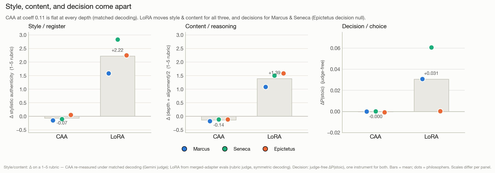
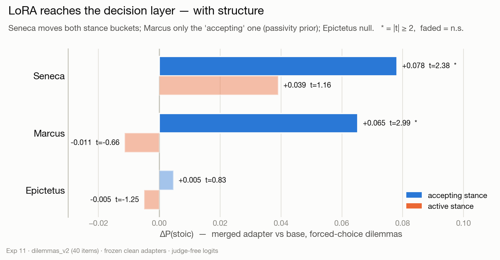
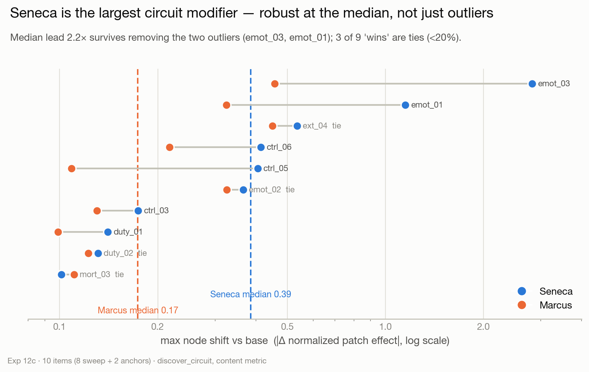
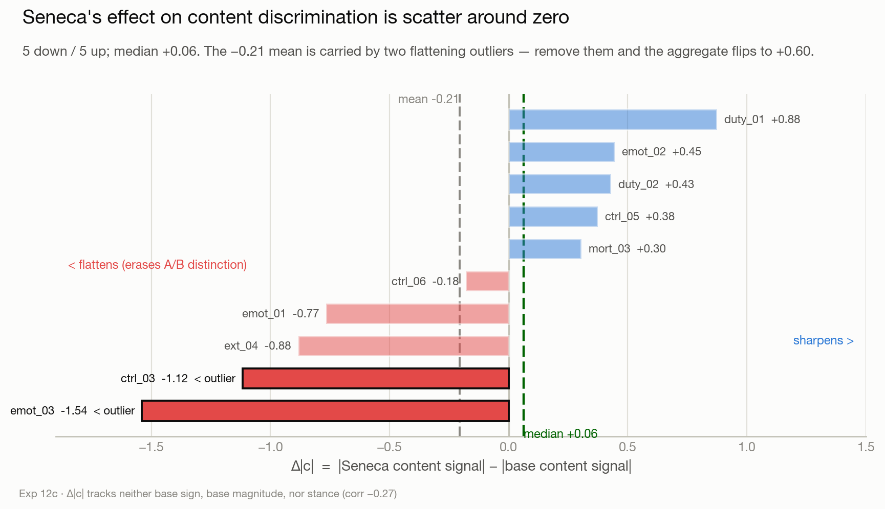

# Weight space vs Activation space - Do they install the same behavior?

Comparing activation addition (CAA) against low-rank weight adaptation (LoRA) on the same behavioral axis. Different circuits, and only LoRA reaches decisions.

**Core finding:** the two methods give different results. Under matched decoding at coefficient 0.11, LoRA (weight-space) moves the judge-free decision instrument, plus judge-scored style and content (single eval, not seed-tested). CAA (activation-space) moves none of them, even though the circuits do change. The earlier positive CAA effects were a measurement artifact[docs/measurement-artifact.md](docs/measurement-artifact.md).



------------------------------------------------------------------------

## Key findings

-   **CAA — no measurable movement.** At coefficient 0.11, decisions, style, and content show no measurable effect. A coefficient sweep at the decision level has not been done, so whether a stronger coefficient would produce real Stoic register is still unclear.

-   **CAA "content effect" — a measurement artifact.** An early measurement reported a large positive effect. Steered text was sampled and truncated to ~13 tokens while baselines were greedy at 100, so the judge was scoring the decoding difference instead of the steering. Under identical decoding, the content effect is null for all three philosophers. Full mechanism and numbers in [docs/measurement-artifact.md](docs/measurement-artifact.md).

-   **LoRA reaches decisions.** On the forced-choice instrument, where CAA is flat, weight-level adaptation moved the choice — measured judge-free from the frozen adapters:

    | Author | ΔP(stoic) | Δlog-odds | t       | Stance buckets     |
    |--------|-----------|-----------|---------|--------------------|
    | Seneca | +0.061    | +0.308    | 2.4–2.6 | positive in *both* |
    | Marcus | +0.031    | +0.161    | 2.0–2.2 | accepting only     |

    The circuit analysis (Exp 12 via ModelLens) shows the same split. CAA leaves the stoic-content circuit essentially untouched. LoRA's circuit perturbation is ordered Seneca > Marcus > Epictetus ≈ 0 — the same ordering as the decision shift. It is robust at the median, and acts on content discrimination in an item-dependent way rather than as a directional push. Full analysis in [results/README.md](results/README.md).

    **Caveat:** the two methods also train on different objectives (CAA is contrastive, LoRA is continued pretraining), so method and objective are confounded. The non-philosophical control adapter in v3 is what separates them.



-   **LoRA does not install uniform Stoic reasoning.** The effects differ by philosopher. Marcus is a broad *passivity prior*: it moves only the "accepting" dilemmas and is flat on the "active" ones. Seneca moves the choice on average, but that average is carried by a handful of items shifting a lot rather than a steady push across all 40 — the per-item sign test is not significant (25 of 40 positive, p = 0.15). Epictetus shows no decision effect at all, but it also has by far the smallest corpus (123 chunks, the Enchiridion only) and a terse, aphoristic style unlike Seneca's letters or Marcus's reflections. A possible Senecan-idiom lexical-echo confound in the decision instrument is also open.





------------------------------------------------------------------------

## Method

Three depths of effect are measured separately:

-   **Style / register** -- LLM-judge scoring of prose (does it sound Stoic?)
-   **Content / reasoning** -- LLM-judge scoring of reasoning in prose
-   **Decision / choice** -- judge-free forced-choice probe over calibrated dilemmas (does the model *pick* the Stoic option?)

Two methods are compared: **CAA** (runtime activation steering) and **LoRA** (fine-tuned adapter weights). Both are analyzed with **ModelLens**, an architecture-agnostic interpretability toolkit (companion project), to compare the circuit topology of the two methods -- including the case where CAA changes circuits without moving behavior at any of the three depths.

Corpora: Marcus Aurelius, Seneca, Epictetus. Three authors used to build contrast pairs along one behavioral axis. Every result here is in behavior (one value dimension). Sycophancy is the planned second axis, and it is what tests whether the locus result holds outside this one.

------------------------------------------------------------------------

## Repo structure

```         
stoic/
  config.py     # paths + canonical config (per-author layer/coeff, decoding)
  model.py      # model loading + the ONE generate() (decoding lives here only)
  steering.py   # CAA: extract_vector(pairs, layer) + steering() context manager
  dilemmas.py   # judge-free forced-choice harness (the 0.542 ruler) + stats
  judge.py      # LLM-as-judge scoring (Gemini) + seed evals
  lora.py       # LoRA merge (fresh base per adapter) + prep/train for Colab
  corpus.py     # Pass B: Gutenberg download, license-strip, slice, chunk
  pairs.py      # Pass B: contrastive pair generation (Claude API)
  results_io.py # checkpoint JSON writing (always under results/<stage>/)
  secrets.py    # API-key lookup (env, then .env) — stages fail fast if missing
  stages/       # stage orchestration: verify.py (0-2), content.py (3+style),
                #   adapters.py (4), passb.py (corpus/pairs)
  __main__.py   # thin CLI: python -m stoic <stage> (parse + dispatch only)
tests/          # CPU-only unit tests (no model download): hook hygiene,
                #   canonical decoding, dilemma math, stats vs published
                #   numbers, reference-wall tripwire, fixture integrity
data/
  reference/    # FROZEN artifacts (pairs, dilemma sets, vectors) — read-only
  generated/    # pipeline output (gitignored)
  MANIFEST.sha256  # checksums of the untracked frozen binaries
models/         # frozen clean LoRA adapters (not in git)
results/        # one JSON per stage checkpoint + results/README.md record
```

## Quickstart

``` bash
# install (core = stages 0-2; extras: [judge] for stage 3, [lora] for stage 4)
pip install -e ".[all]"

# fetch the frozen binaries (steering vectors + LoRA adapters) — needed for
# Stages 2 and 4 only; downloads ~26 MB and verifies against data/MANIFEST.sha256
python scripts/fetch_artifacts.py

# Pass A checkpoints
python -m stoic all       # stages 0-2: determinism, 0.542 baseline, vectors + CAA null
python -m stoic stage3    # judge-scored content effect (needs GEMINI_API_KEY, ~$1-2)
python -m stoic stage3 --sampled   # matched-sampled variant
python -m stoic style     # style/register validation under matched decoding
python -m stoic stage4    # LoRA decision shift (judge-free, $0)

# Pass B — regenerate the corpus from source (self-contained)
python -m stoic corpus    # download + slice + chunk into data/generated/, verify counts
python -m stoic pairs     # regenerate contrastive pairs (needs ANTHROPIC_API_KEY, $)

# Unit tests (CPU-only, seconds, no model download)
pip install -e ".[dev]" && pytest
```

Setup notes: `meta-llama/Llama-3.2-3B` is gated on Hugging Face (accept the license, then `huggingface-cli login`). The frozen steering vectors and LoRA adapters are hosted separately (too large for git) at [`seb-vil/llama-3.2-3b-stoic-steering`](https://huggingface.co/seb-vil/llama-3.2-3b-stoic-steering); `scripts/fetch_artifacts.py` downloads them into place and verifies against `data/MANIFEST.sha256`. Stage 3 / style need `GEMINI_API_KEY` and Pass-B pairs need `ANTHROPIC_API_KEY` (env or a project-root `.env`); `corpus` needs neither. Everything runs on local CPU (\~16 GB RAM); a Colab T4 is only needed to *retrain* adapters.

------------------------------------------------------------------------

## Status

**Verified:**

-   Dilemma baseline 0.541602, CAA decision null (ΔP to 4 decimals), LoRA decision shifts (all authors, all stance buckets, to 4 decimals).
-   The judge-scored CAA effects are a single decoding-asymmetry artifact: content (+0.41…+0.77 → null) and style (+1.0…+1.6 → null) both collapse under matched decoding. Mechanism + numbers: [docs/measurement-artifact.md](docs/measurement-artifact.md) - full record in [results/README.md](results/README.md).
-   Corpus acquisition is self-contained: `python -m stoic corpus` re-downloads and re-chunks the source texts, reproducing the frozen chunk counts exactly (437 / 540 / 123; the stage compares counts, not byte-level chunk content).

**In progress / next (priority order):**

1.  Refactor so the behavioral axis is set in a config file rather than hardcoded. Adding a new axis should not require touching the pipeline code. Existing results have to come out identical afterward.
2.  Regression tests for ModelLens — mainly that hooks get removed properly when something errors out. Step 5 runs through those hooks, so this comes first.
3.  `dilemmas_v3` — a new dilemma set built to answer one question: when a LoRA adapter shifts the model's choice, is that reasoning, or is the model just matching Senecan wording in the option text? Four groups of items, crossing topics Seneca writes about against topics he doesn't, and plain wording against Stoic wording. Calibrated so the base model is near 50/50 on every group before anything is measured.
4.  Run the LoRA adapters against v3 — all three authors, plus a control adapter trained on non-philosophical text of the same length. Without the control, "LoRA moves decisions" can't be separated from "any fine-tuning moves decisions."
5.  Repeat the circuit analysis on v3 items. The current circuit results are one item per stance, which is a pilot, not a finding. Gated on step 2.
6.  Figure 1 — the CAA and LoRA circuits side by side, with the unmodified model as a reference panel.
7.  Add a second behavioral axis: sycophancy. Same three measurements and the same circuit comparison, on something that isn't philosophy. This is what shows whether the result is about intervention methods or just about Stoicism. Gated on step 1.
8.  Vary temperature and random seed to see whether the decision results hold up, on both axes. Gated on step 3: if v3 says the philosophy result is just wording, run this on sycophancy only. If both axes come back empty, drop it.
9.  Pass B — rebuild the contrastive pairs from the source texts and re-run stages 2–4, to check the pipeline gives the same answer on fresh data.
10. Remaining figures, then the write-up.

Descoped: retraining Epictetus on the full corpus. That adapter shows no decision effect, but it also has the smallest corpus by far (123 chunks against 437 and 540), so it's an underpowered arm rather than a real null. Whether corpus size explains it stays an open question in the write-up, not a work item.

------------------------------------------------------------------------

## Notes

Companion project: **ModelLens**, the architecture-agnostic interpretability toolkit used for the circuit-topology comparison. Some of the source texts and earlier measurements predate this repository; the measurement corrections, verification records, and corpus pipeline here are authoritative.