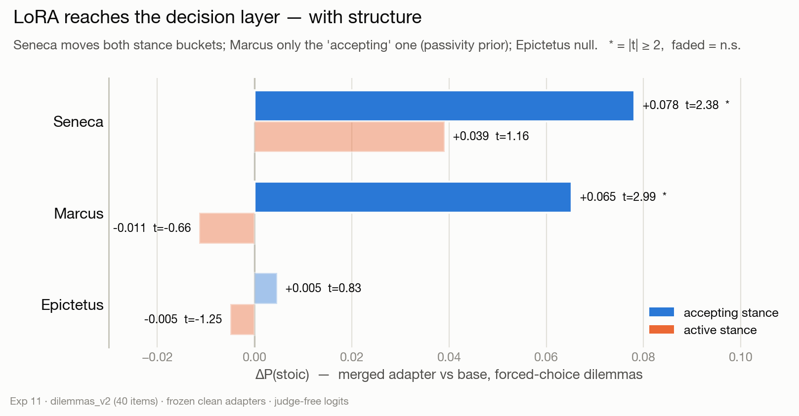
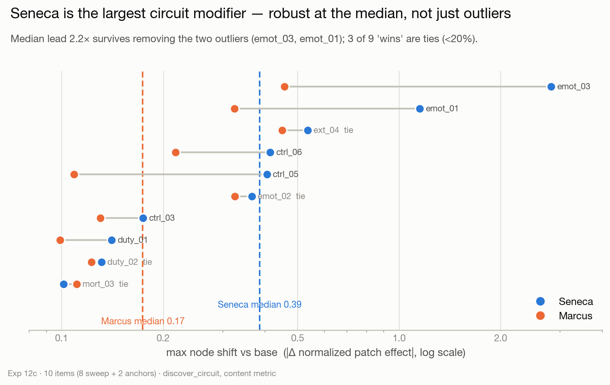
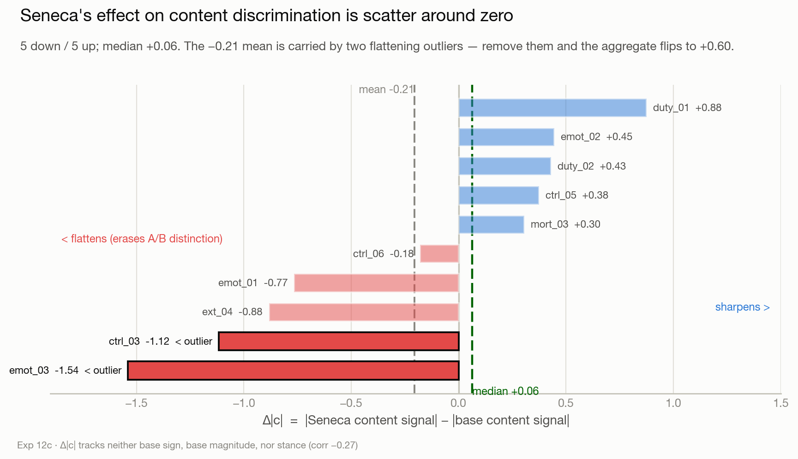

# Verification record

One JSON per stage checkpoint. `data/reference/` holds this repo's frozen
regression fixtures (pairs, dilemma sets, steering vectors); each stage runs the
pipeline against them and checks the result. Run with the `stoic-llm` conda env
(py3.11, torch 2.5.1, transformers 4.57.3) via `python -m stoic all`.

| Stage | Checkpoint | Target | Result | Status |
|---|---|---|---|---|
| 0 | Deterministic decoding | same prompt → identical output twice | identical | ✅ PASS |
| 1 | Base P(stoic) on v2 set | 0.542 (fixture 0.541601902275579) | **0.541602** | ✅ PASS |
| 2 | New vs frozen vectors | cosine ≥ 0.99 | 1.0000 (all 3) | ✅ PASS |
| 2 | Injection site (Epictetus L8) | bites `hidden_states[9]`, not `[8]` | confirmed | ✅ PASS |
| 2 | Steered dilemmas ≈ flat (CAA decision null) | ΔP ≈ 0 all authors | see below | ✅ PASS |

### Stage 2 — CAA at coeff 0.11 is flat at the decision level

| Author | Layer | cosine→frozen | ΔP (pipeline) | ΔP (fixture) |
|---|---|---|---|---|
| Marcus | 26 | 1.0000 | −0.0001 | −0.0001 |
| Seneca | 4 | 1.0000 | +0.0002 | +0.0002 |
| Epictetus | 8 | 1.0000 | −0.0007 | −0.0007 |

Vectors are extracted at the same site they inject (`layers[L].mlp`), from the
frozen fixture pairs, and match the frozen `.pt` vectors to 4 decimals in both
direction (cosine) and magnitude (norm ratio 1.000). CAA moves decisions
**not at all** — the decision-level null.

## Reference repair (Stage 2 prerequisite)

`data/reference/processed/epictetus/neutral_pairs.json` was syntactically corrupt
in the assembled reference set (malformed JSON: an object-of-objects `{ {...} }`
instead of a valid array/`{"pairs":[...]}`). Its 53 pairs were verified
**byte-identical** (after strip) to a verified-intact copy of the same file, and
the reference file was restored from that copy (content unchanged, JSON now
valid). The corrupt copy is archived in the session scratchpad, not in the repo.

## Stage 3 — the CAA content effect does not survive matched decoding

An earlier measurement reported a large CAA content effect (Marcus +0.408,
Seneca +0.583, Epictetus +0.767, Gemini judge). It **does not survive matched
decoding**. Root cause: the steered-generation path dropped
`do_sample`/`max_new_tokens`, so steered text was **sampled (temp 0.6, top-p 0.9)
and truncated to ~13 tokens** while the baseline was **greedy, 100 tokens** — the
judge scored the decoding difference, not the steering. Full mechanism:
[docs/measurement-artifact.md](../docs/measurement-artifact.md).

Measured with one canonical `generate()` (both sides identical decoding), same
frozen vectors (cosine 1.0000), same judge (gemini-2.5-flash), n=5 seeds:

| Author | Layer | earlier (artifact) | Matched greedy | Matched sampled |
|---|---|---|---|---|
| Marcus | 26 | +0.408 ± 0.136 | −0.175 ± 0.054 | +0.075 ± 0.165 (n.s.) |
| Seneca | 4 | +0.583 ± 0.121 | −0.117 ± 0.054 | −0.042 ± 0.204 (n.s.) |
| Epictetus | 8 | +0.767 ± 0.076 | −0.117 ± 0.080 | −0.192 ± 0.329 (n.s.) |

At coeff 0.11 the steered greedy output is byte-identical to baseline (greedy
text only visibly changes at coeff ≥ 1.0), and the sampled distribution doesn't
move either. **CAA at 0.11 is null at the content level under fair measurement.**
This strengthens rather than weakens the decision-level story: the CAA-flat
decision result (Stage 2) is measured on logits, immune to the artifact, and
stands.

JSONs: `stage3_content_judge/content_20260704_192154.json` (greedy),
`content_sampled_20260705_001353.json` (sampled).

## Style validation — the register claim collapses too

The earlier stylistic-authenticity deltas (Marcus +1.00, Seneca +1.42,
Epictetus +1.58) — the effect once treated as "the robust, valid result" — were
re-tested under matched decoding at the canonical clean configs (pre-registered
rule: survives if seed-averaged style delta > 2σ above zero in either regime;
n=5 seeds, same hardened Gemini judge):

| Author | earlier (artifact) | Matched greedy | Matched sampled | Verdict |
|---|---|---|---|---|
| Marcus | +1.00 | −0.150 ± 0.181 | −0.033 ± 0.139 | collapses |
| Seneca | +1.42 | −0.100 ± 0.091 | −0.017 ± 0.260 | collapses |
| Epictetus | +1.58 | +0.050 ± 0.126 | −0.017 ± 0.124 | collapses |

The greedy arm re-scored the saved Stage 3 generations (byte-identical pairs
scored as delta 0 by construction); the sampled arm regenerated the seeded
Stage 3 texts. Under fair measurement CAA at coeff 0.11 moves **nothing** —
style, content, or decisions. The old "style moves robustly" signal was the
judge reacting to short sampled snippets vs long greedy baselines.

Caveats recorded in the JSON: canonical configs (the earlier measurement used
superseded all-L8 picks), and coefficient 0.11 only — greedy output barely changes below
coeff ~1.0, so whether any coefficient produces genuine Stoic register under
matched decoding is untested (future sweep).

JSON: `style_validation/style_20260705_212411.json`.

## Stage 4 — LoRA decision shift (judge-free)

Frozen clean adapters merged onto a fresh base each (no stacking possible),
judge-free logit eval, all local CPU. Every number matches the frozen fixture
(`data/reference/dilemmas/v2/lora/dilemma_eval_20260701_140942.json`)
to the fourth decimal:

| Author | ΔP overall | t | accepting (n=22) | active (n=18) | Pattern |
|---|---|---|---|---|---|
| Marcus | +0.0307 | 2.00 | +0.0652 (t=2.99) | −0.0114 (n.s.) | passivity prior |
| **Seneca** | **+0.0606** | **2.58** | **+0.0781 (t=2.38)** | **+0.0391 (t=1.16)** | **both buckets positive ✓** |
| Epictetus | +0.0003 | 0.07 | +0.0046 | −0.0051 | null (smallest corpus) |

Base integrity held: baseline 0.541602 before AND after all three merges,
max per-item drift 0.00e+00 — the fresh-base-per-adapter rule verified.

With Stage 4 done, **verification is complete.** Final scoreboard: everything
logit-measured is exact against the fixtures (Stages 1, 2, 4 — the 0.542
baseline, the CAA decision null, the LoRA decision shift); everything
judge-scored on the CAA side was a decoding artifact (Stage 3 + style
validation). LoRA is the only intervention with real effects, and it reaches
the decision layer.

JSON: `stage4_lora_dilemmas/lora_dilemmas_20260705_225558.json`.

## Exp 12 — circuit topology: CAA leaves the circuit untouched, LoRA rewires it (new work)

First run of ModelLens `discover_circuit` (activation patching over all 56
attn/mlp sublayers) on the Stage-4-verified clean adapters — not the old
bridge scripts. Content-relevant metric: logit(" A") − logit(" B") on dilemma
`ctrl_03`, clean = stoic option as A, corrupted = options swapped — the only
input difference is *which option is Stoic*. Matched data across all seven
conditions; base model as shared control; threshold 0.15; attention-routing
edges added via an eager-attention pass.

| Condition | clean | total effect | max node shift vs base | topology |
|---|---|---|---|---|
| base | +3.88 | −8.97 | — | 33 nodes: early/mid processors (0–15), late gate cluster (MLP 23/25/26/27), booster attn 26 |
| CAA marcus | +3.91 | −8.98 | ±0.003 | identical to base |
| CAA seneca | +3.98 | −9.17 | ±0.012 | identical to base |
| CAA epictetus | +3.86 | −8.95 | ±0.015 | identical to base |
| LoRA marcus | +3.62 | −8.47 | ±0.130 | moderately shifted |
| **LoRA seneca** | **+2.45** | **−6.73** | **±0.174** | **+1 booster, −1 gate, blocks 1/5 reweighted** |
| LoRA epictetus | +4.03 | −8.88 | ±0.032 | near-base |

Findings:
1. **CAA at coeff 0.11 does not change the stoic-content circuit at all**
   (max normalized-effect shift 0.015) — the circuit-level view agrees with
   the behavioral nulls at every level.
2. **LoRA rewires the circuit in proportion to its behavioral decision
   effect: Seneca > Marcus > Epictetus ≈ 0** — the same ordering as the Stage 4
   LoRA dilemma shifts. Seneca's raw sensitivity to which-option-is-stoic
   *compresses* (−8.97 → −6.73) even as it chooses the Stoic option more.
3. The "circuit topology predicts the behavioral split" claim now
   rests on `discover_circuit` with a content metric and clean adapters.

Note: ModelLens's `_capture_activations` had a closure bug that made
activation patching unrunnable; fixed upstream (ModelLens `44d9b77`) and run
against the fix. Figures: `exp12_circuits/exp12_circuit_{author}.png`
(Base | CAA | LoRA side-by-side). JSON: `exp12_circuits/exp12_20260706_231538.json`.
Runtime ~59 min patching + ~5 min attention pass, all local CPU, $0.

### Exp 12b — active-stance confound test on `duty_01` (n=1 pilot)

`ctrl_03` is an *accepting*-stance item, and LoRA's behavioral effects
concentrate in the accepting bucket — so the ctrl_03 circuit result cannot
distinguish a Stoic-reasoning circuit from a mere acceptance/passivity
circuit. `duty_01` breaks the tie: its Stoic option is to ACT (speak up
against injustice at personal cost) and its non-stoic option is passive
self-protection. Stance: active; concept: duty_and_role; token counts 77/77;
content signal c = +2.289 (~half of ctrl_03's +4.48 — circuit expected
noisier; floor-caveats apply).

**Phase 1 — behavioral pre-check** (from the Stage 4 per-item data;
item baseline P(stoic) = 0.892, near ceiling, so read Δlog-odds):

| Author | ΔP | Δlog-odds | Direction on the act-option | Rank in own 40 items |
|---|---|---|---|---|
| Marcus | −0.020 | **−0.193** | AWAY — matches the passivity-prior prediction | #24/40 (within noise) |
| Seneca | +0.065 | **+0.990** | TOWARD — anti-passive, Stoic-consistent | #12/40 (substantial) |
| Epictetus | −0.007 | −0.066 | ~null, as expected | #25/40 |

Marcus's sign flips exactly where passivity and Stoicness point in opposite
directions; Seneca tracks the Stoic option regardless of stance. Single-item
caveat: only Seneca's shift is large within its own distribution.

**Phase 2 — circuit comparison** (same discover_circuit harness; metric
asserted non-default; fresh-base merges; base integrity 0.892233 → 0.892233,
drift 0.000000). Base late-gate cluster: **CLEAN/resolvable** (5 late nodes,
max |effect| 0.440) — the floor-limited branch does not apply.

| Condition | clean | total effect | nodes | max shift vs base |
|---|---|---|---|---|
| base | +2.97 | −4.58 | 22 | — |
| CAA ×3 | +2.97…+2.98 | −4.59…−4.61 | 21–22 | ±0.005–0.009 (no-op again) |
| **LoRA seneca** | **+3.53** | **−6.33 (+38% sensitivity)** | 19 | **±0.141**, 26.attn↔26.mlp role swap, mid-blocks 8–12 pruned, block-15 attn demoted from critical |
| LoRA marcus | +2.25 | −3.91 (−15%) | 15 | ±0.099, late cluster role-identical to base |
| LoRA epictetus | +2.72 | −4.33 | 21 | ±0.038 (≈ base) |

**Pre-registered Seneca criteria (literal): (a) NO, (b) NO, (c) NO — inverted.**
No new booster (base already has late boosters on this item; Seneca swaps
roles at block 26 instead), no gate attenuated (all strengthen), and the
clean metric RISES (+2.97→+3.53) with content sensitivity AMPLIFIED
(−4.58→−6.33) where ctrl_03 showed compression.

**But the signature did not vanish — it inverted.** Seneca-LoRA is again the
strongest circuit modifier by every measure, and its effect flips sign with
the item's stance: compress-on-accepting (ctrl_03) → amplify-on-active
(duty_01), in lockstep with behavior (toward the Stoic option on both).

**Marcus pre-registered criterion: YES — stable.** Late gate preserved
exactly (same role membership as base) while early/mid processing
reorganizes and sensitivity compresses −15%, despite the flipped behavioral
sign. The passivity-prior account survives the circuit-level test.

**Three-way verdict:** the acceptance-circuit branch is **rejected on its own
precondition** (it required vanishing; base was clean and the restructuring
is emphatically present). The Stoic-reasoning branch is supported only in a
*transformed* sense — the pre-registered literal signature was too narrow;
what replicates is "Seneca rewires the stoic-content circuit, stance-
modulated." n=1-per-stance discipline: strong pilot, not a settled claim;
the stance-balanced sweep (3–5 items per bucket) is the follow-up.

Figures: `exp12_circuits/exp12_circuit_duty_01_{author}.png`.
JSON: `exp12_circuits/exp12_20260707_163121.json` (47 min patching + edge pass, $0).

### Exp 12c — stance-balanced sweep: stance modulation NOT established; Seneca = strongest modifier, character item-dependent

**Pre-check (gate):** the base content metric is stance-dependent in sign and
magnitude (accepting: c mean +0.70, 12/22 positive, |c| 1.46; active: c mean
−0.07, only 6/18 positive, |c| 0.97 — `exp12_sweep_precheck_*.json`). The
anchor-based "compress-on-accepting / amplify-on-active" claim was therefore
confounded and **retired**; |sensitivity|-% is reported as legacy only.
Primary outcome replaced with **signed Δc** (adapter c − base c; Δc > 0 =
pushed toward the Stoic option).

**Design:** 8 new items (4/bucket, sign-representative — active bucket
includes its majority-negative items — and |c|-matched: sample means 1.77 vs
1.81) + the 2 anchors reused = 10 items × base/Seneca/Marcus. CAA and
Epictetus deferred (settled no-op/null). All guardrails held: metric asserted
non-default, one fresh-base merge per adapter, per-item P(stoic) drift
0.000000 ×8, all 10 base late-gate clusters clean/resolvable (no floor
exclusions). 24 circuits, 145 min, $0.

**Seneca Δc by stance** (primary pre-registered question):

| | accepting | active |
|---|---|---|
| per-item Δc | −1.12, −0.18, +0.30, +0.88, +0.77 | +0.88, +0.38, +1.54, −0.43, −0.45 |
| mean | +0.13 | +0.38 |
| signs | 3+/2− | 3+/2− |

Neither uniformly positive nor sign-consistent by stance: **scattered**. The
c>0 subset (the sign-matched comparison) shows the anchor-like split
(accepting −0.33 vs active +0.63) but at n=3 vs n=2 it is anchor-dominated —
drop ctrl_03 and the accepting side collapses to +0.06. The setpoint check
(Δc vs base c) also fails: Seneca shrinks |c| on exactly 5/10 items. The
duty_01/ctrl_03 "inversion" was a two-point coincidence amplified by the
confounded measure.

**What DOES generalize:**
- **Seneca produces the largest circuit perturbations — robust at the median,
  not just outlier-driven** (median max node shift 0.386 vs Marcus 0.174,
  2.2×; survives removing the two outliers). But the raw "9/10 wins" overstates
  it: 6 clear wins, 3 effective ties (within 20%: ext_04, emot_02, duty_02),
  1 Marcus win — the lead is large on high-magnitude items and narrows to a
  near-tie on low-magnitude ones. **Effect on content discrimination (Δ|c|):**
  across all 10 items Seneca's effect is 5 down / 5 up by direction, with
  median Δ|c| = +0.06 — no effect on discrimination for a typical item. The
  mean is −0.21, dragged negative by two large flattening events (emot_03
  −1.54, ctrl_03 −1.12); removing those two flips the aggregate to
  net-sharpening (+0.60). Flatten-vs-sharpen tracks neither base sign, base
  magnitude, nor stance. Seneca's effect on the content circuit is
  item-dependent scatter around zero — not a directional push and not a
  uniform disruption — consistent with 12c's scattered signed Δc. The apparent
  net flattening is carried by two high-magnitude outliers, not a global
  mechanism. (Read-only re-analysis: `exp12_reanalysis_modifier_*.md`.)
- **Marcus's passivity-prior signature generalizes: late gate role-set
  preserved on 9/10 items** (sole exception ext_04) with moderate early/mid
  reorganization — structurally stable across both stances and both base-c
  signs, exactly as the 2-anchor pilot suggested.

**Pre-registered verdict: branch 3.** "Seneca pushes Stoic content
everywhere" is rejected (4/10 negative Δc); genuine stance modulation is not
established (no consistent sign-by-stance); the standing claim is *Seneca is
the strongest circuit modifier, character item-dependent*. Marcus
(passivity prior) and CAA (no-op) remain the settled findings.

Figures: `exp12_circuits/exp12_sweep_{item}.png` (base | Seneca | Marcus;
sequential edges only — eager-attention pass available on request).
JSON: `exp12_circuits/exp12_sweep_20260708_124712.json`. Readout:
`python scripts/exp12_sweep.py report <json>`.

Figures rendered by `scripts/make_figures.py` (validated palette, corrected
framing baked in). These supersede the earlier ad-hoc PNGs of the same three
results.
